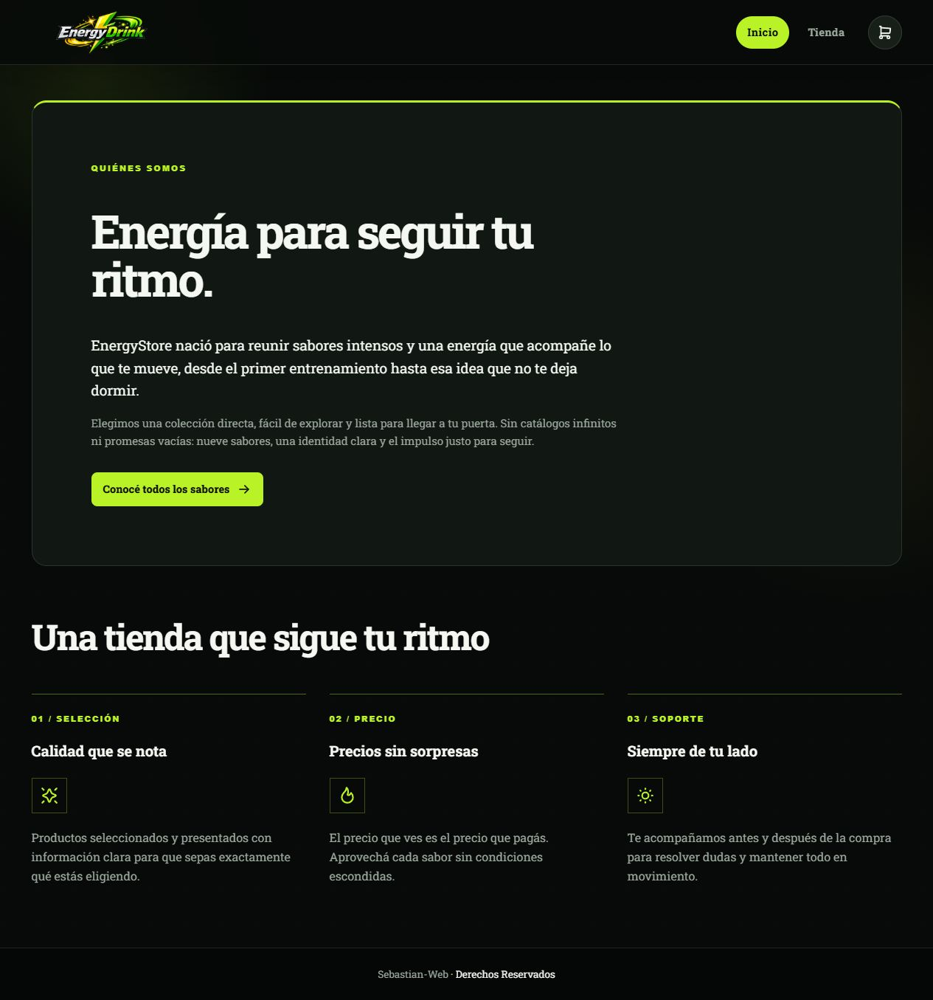
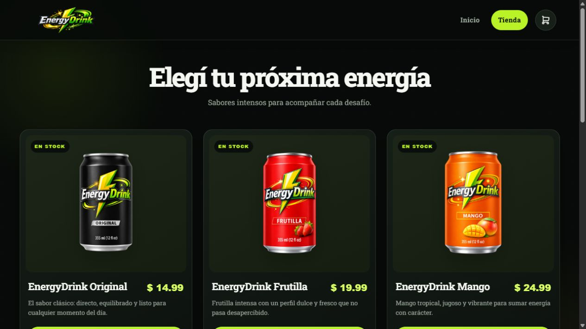

# EnergyStore

EnergyStore es una tienda web de bebidas energéticas construida como proyecto frontend. Incluye una página de presentación, un catálogo dinámico de nueve sabores y un carrito de compras persistente.

## Vista previa





## Funcionalidades

- Sitio multipágina con secciones de Inicio y Tienda.
- Catálogo generado dinámicamente desde un archivo JSON local.
- Nueve productos con nombre, descripción, precio e imagen transparente.
- Carrito con agregado, eliminación y actualización de cantidades.
- Cálculo automático del total de la compra.
- Persistencia del carrito mediante `localStorage`.
- Confirmaciones visuales con SweetAlert2.
- Diseño responsive para escritorio, tablet y dispositivos móviles.

## Tecnologías

- HTML5
- CSS3
- JavaScript con módulos ES
- Vite 8
- SweetAlert2
- JSON como fuente de datos local

## Requisitos

- Node.js `^20.19.0` o `>=22.12.0`
- npm

## Instalación y ejecución

```bash
git clone https://github.com/Koridormi/Energy-Store-Web.git
cd Energy-Store-Web/EnergyStore
npm install
npm run dev
```

Vite mostrará en la terminal la dirección local para abrir el proyecto, normalmente `http://localhost:5173`.

## Scripts disponibles

```bash
npm run dev      # Inicia el servidor de desarrollo
npm run build    # Genera la versión de producción
npm run preview  # Previsualiza la compilación de producción
```

## Estructura principal

```text
Energy-Store-Web/
├── EnergyStore/
│   ├── css/                 # Estilos globales y responsive
│   ├── js/app.js            # Catálogo y lógica del carrito
│   ├── pages/tienda.html    # Página del catálogo
│   ├── public/
│   │   ├── db/db.json       # Datos de los productos
│   │   └── img/             # Logo e imágenes de productos
│   ├── index.html           # Página de inicio
│   ├── package.json
│   └── vite.config.js
└── media/                   # Capturas utilizadas en este README
```

## Consideraciones

Este proyecto representa el frontend de una tienda. El botón de pago simula la finalización de la compra y no está conectado a una pasarela de pagos ni a un backend.

## Autor y licencia

Proyecto de [Koridormi](https://github.com/Koridormi), distribuido bajo la licencia [MIT](LICENSE).
